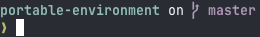
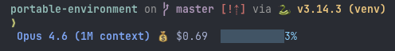

# portable-environment

Portable minimal, opinionated dotfiles for Mac, managed with [rcm](https://github.com/thoughtbot/rcm).

## What's included

### Shell (zsh + antidote)

[Antidote](https://getantidote.github.io/) plugin manager, with a configuration approach based on [zdotdir](https://github.com/getantidote/zdotdir). Plugins are declared in a single `.zsh_plugins.txt` file and organized by category:

- **Completions** — [fzf-tab](https://github.com/Aloxaf/fzf-tab) for fuzzy Tab completion, [zsh-completions](https://github.com/zsh-users/zsh-completions) for extra definitions, [ez-compinit](https://github.com/mattmc3/ez-compinit) for fast init
- **Editing** — sensible keybindings (Home/End/Delete just work), emacs and vi mode support
- **History** — shared across sessions, deduplication, substring search with Up/Down
- **Utilities** — macOS helpers (`cdf`, `flushdns`), safe `rm`/`mv`/`cp`, `extract` for any archive, git aliases (`gst`, `gco`, `gl`, `gp`, etc.)
- **Fish-like features** — syntax highlighting, autosuggestions (right-arrow to accept), history substring search

### Prompt

[Starship](https://starship.rs/) cross-shell prompt.



### Directory navigation

[Zoxide](https://github.com/ajeetdsouza/zoxide) — `z` to jump to frecent directories.

### Editors

[Spacemacs](https://www.spacemacs.org/) configuration. Shell aliases: `et` (terminal) and `e` (GUI Emacs.app).

### Terminal multiplexer

[tmux](https://github.com/tmux/tmux) configuration.

### Git

Aliases (via oh-my-zsh git plugin), global gitignore.

### macOS

Emacs keybindings system-wide (`Library/KeyBindings`). `macos-defaults.sh` configures system preferences: standard function keys, fast key repeat, list-view Finder, tap-to-click, auto-hiding Dock, screen saver hot corner, and immediate lock-screen password.

### Homebrew packages

`Brewfile` tracks shell dependencies and daily-driver tools.

### Claude Code

Custom settings and [Starship](https://starship.rs/) integration via [cship](https://cship.dev/) (`claude/`).


macOS notification hooks (`claude/notify.sh`) fire on Stop and PermissionRequest events: shows the tool name when approval is needed, detects whether the final assistant message is a question and notifies accordingly ("Question / decision needed" vs "Task complete"), and includes the tmux session/window as subtitle for context.


## Setup

```sh
# Install rcm
brew install rcm

# Clone this repo
git clone <repo-url> ~/git/portable-environment

# Install Homebrew packages
brew bundle --file=~/git/portable-environment/Brewfile

# Link all dotfiles
rcup -d ~/git/portable-environment

# Apply macOS system preferences (keyboard, trackpad, Finder, Dock, etc.)
bash ~/git/portable-environment/macos-defaults.sh
```

For Claude Code config, remove any existing files before running `rcup` so rcm can place its symlinks:

```sh
rm -f ~/.claude/settings.json
rcup -d ~/git/portable-environment
```

## Attribution

The zsh configuration approach is inspired by [zdotdir](https://github.com/getantidote/zdotdir).
